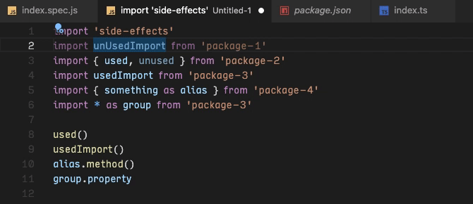
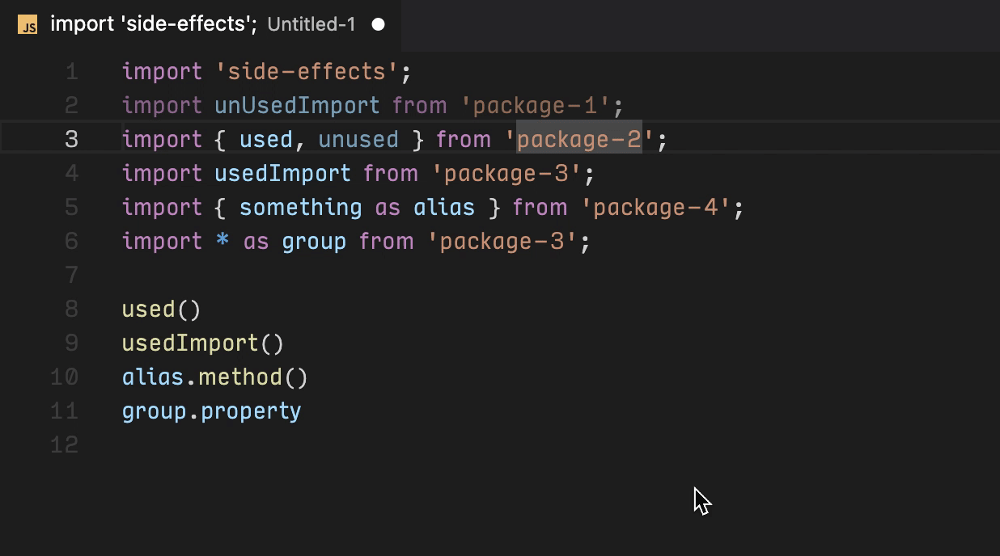

# [DEPRECATED] Remove Unused Imports

## ⚠️ You may not need this extension!

VS Code already provides this functionality through [Code Actions](https://code.visualstudio.com/docs/editor/refactoring#_code-actions-quick-fixes-and-refactorings) (I didn't know it 🤷‍♀️). You can remove one or multiple unused imports by placing the cursor over an unused import (faded) and pressing `Ctrl/Cmd + .`. A contextual menu will appear with options to remove the unused imports.

## Description

VS Code extension to remove unused ES6 imports inside JavaScript and TypeScript files (`.js`, `.jsx`, `.ts` and `.tsx` extensions) without changing the current order, as opposed to the built-in VS Code "Organize Imports" functionality.

## Usage

- **Open the Command Palette** (`Ctrl/Cmd + Shift + P`)
- Search for **Remove Unused Imports**

### Keybinding

This extension **does not provide any keybinding** for the command. You can assign your own custom keybinding for it by pressing the cog icon that appears to the right of the command name in the Command Palette.

## Known issues

The format of the document may change after running this command. For instance, final semicolons are added to the modified imports.

## Acknowledgments

This extension is inspired by [vsc-sort-imports](https://github.com/amatiasq/vsc-sort-imports).

## License

This project is licensed under the [MIT License](LICENSE).
